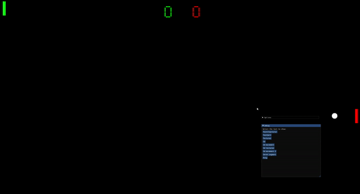
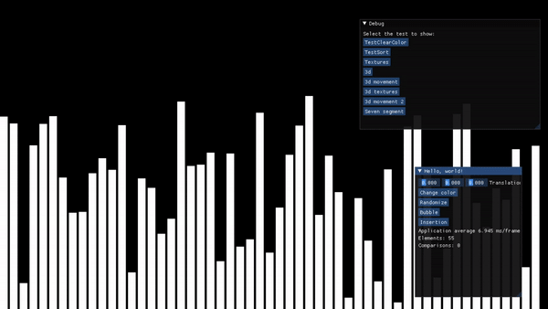
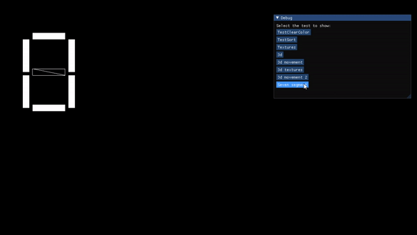
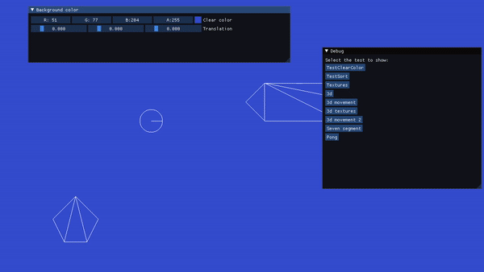

# OpenGL First Project
My first project with openGL, learning how to render 2d and 3d objects, load textures, play sounds etc. with openGL (glfw and glew). 

I learned OpenGL with the youtube channel [The Cherno](https://www.youtube.com/channel/UCQ-W1KE9EYfdxhL6S4twUNw), so I took ispiration from his code (in other words, there may be some similar/identical code in some parts). Other resources I used: 
    - [OpenGL-Tutorial](https://www.opengl-tutorial.org/) 
    - [LearnOpenGL.com](https://learnopengl.com/Getting-started/Transformations) 
 
I made several tests to... test what I can do with OpenGL, and they can be selected by the menu created with ImGUI. 
The dependencies are: 
    - GLFW 
    - GLEW 
    - stbimage (image loading) 
    - glm (math stuff) 
    - irrKlang (audio) 
 
The tests are created include: 
    - Sorting algorithms visualization (for now insertion sort and bubble sort) 
    - 2d and 3d rendering 
    - Camera movement with mouse and keyboard 
    - Texture loading 
 

## Test examples

### Pong example

### Sort example

### Seven segment display example

### Others examples

